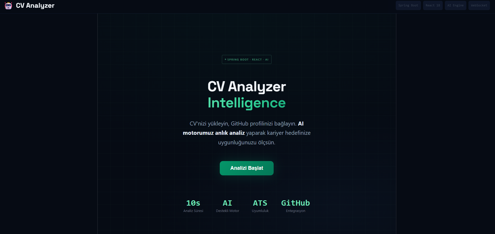
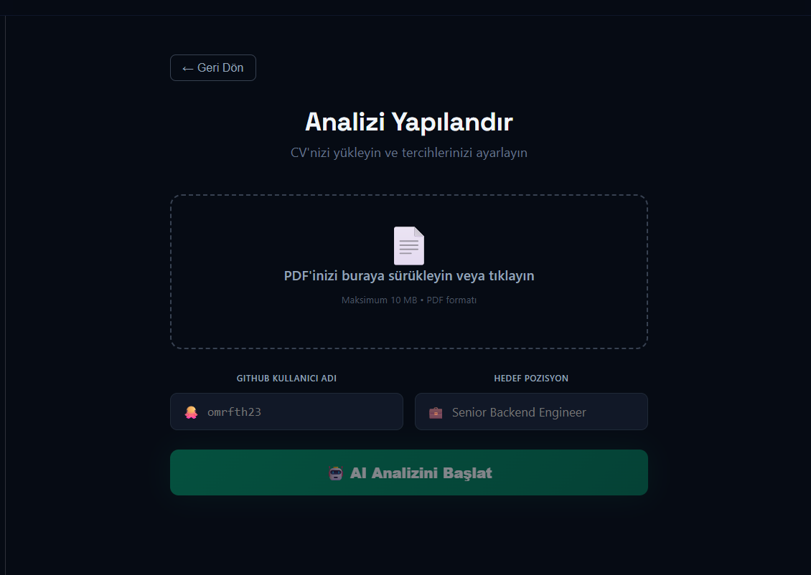
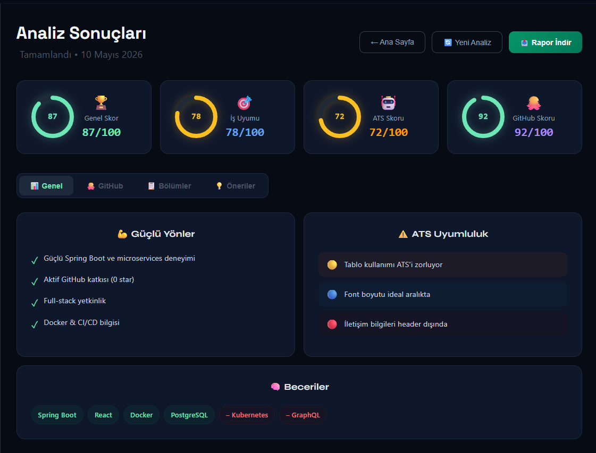

# CV Analyzer - AI-Powered Resume Analysis Platform

<div align="center">

[](https://www.oracle.com/java/)
[](https://spring.io/projects/spring-boot)
[](https://react.dev/)
[](https://spring.io/projects/spring-ai)
[](https://www.docker.com/)


An intelligent CV analysis platform powered by Spring AI and Claude that provides real-time AI insights on resume optimization, ATS compatibility, and career alignment.

[Live Demo](#demo) • [Features](#features) • [Architecture](#architecture) • [Setup](#setup) • [Contributing](#contributing)

</div>

---

## 🎯 Project Overview

**CV Analyzer** is a full-stack, enterprise-ready web application designed to help professionals optimize their CVs through AI-powered analysis. It integrates with GitHub profiles to evaluate technical skills, provides ATS (Applicant Tracking System) compatibility checks, and delivers actionable recommendations for career advancement.

### Key Highlights
- **Real-time AI Analysis**: Powered by Spring AI with Claude LLM integration
- **WebSocket Communication**: Live progress updates during analysis
- **Full-Stack Modern Stack**: Spring Boot 4.0 + React 19 with TypeScript
- **GitHub Integration**: Automatic profile evaluation and metrics extraction
- **PDF Processing**: Advanced text extraction and parsing
- **Production-Ready**: Docker support, security hardening, error handling

---

## ✨ Features

### Core Functionality
- ✅ **AI-Powered CV Analysis** - Multi-dimensional resume evaluation
- ✅ **ATS Compatibility Checking** - Identify formatting issues that block recruiters
- ✅ **Job Match Scoring** - Alignment assessment with target positions
- ✅ **GitHub Profile Integration** - Automatic extraction of repositories, languages, contributions
- ✅ **Real-time Progress Tracking** - Live WebSocket updates during analysis
- ✅ **Comprehensive Reports** - Detailed insights with actionable recommendations

### Analysis Metrics
| Metric | Purpose |
|--------|---------|
| **Overall Score** | Composite assessment (0-100) |
| **Job Match** | Alignment with target role (0-100) |
| **ATS Score** | Recruiter system compatibility (0-100) |
| **Skills Analysis** | Technical skill detection & gaps |
| **Experience Evaluation** | Work history assessment |
| **Education Review** | Qualification evaluation |

---

## 🏗️ Architecture

### System Design

```
┌─────────────────────────────────────────────────────────────┐
│                    Frontend (React 19)                      │
│  ┌──────────────┬──────────────┬──────────────────────────┐ │
│  │ Landing Page │ Upload Page  │ Progress & Results Pages │ │
│  │              │              │                          │ │
│  └──────────────┴──────────────┴──────────────────────────┘ │
│         ↓                           ↓                        │
│  Framer Motion Animations    STOMP WebSocket Subscription   │
└─────────────────┬────────────────────────┬──────────────────┘
                  │                        │
                  ↓                        ↓
        ┌──────────────────────────────────────────┐
        │  REST API & WebSocket Gateway            │
        │  (Spring Boot 4.0.6 / Java 21)          │
        └──────────────┬─────────────────────────┘
                       │
        ┌──────────────┴──────────────┐
        ↓                             ↓
    ┌────────────────────┐    ┌──────────────────┐
    │ Core Services      │    │ AI Integration   │
    │ ├─ CV Upload       │    │ ├─ Spring AI     │
    │ ├─ Text Extraction │    │ ├─ Claude LLM    │
    │ ├─ Analysis Engine │    │ └─ Prompt Design │
    │ └─ GitHub Sync     │    └──────────────────┘
    └────────────────────┘
        │
        ↓
    ┌────────────────────────────────────┐
    │ Data Layer                         │
    │ ├─ PostgreSQL (Analysis Results)   │
    │ ├─ MinIO (File Storage)            │
    │ └─ Redis (Caching)                 │
    └────────────────────────────────────┘
```

### Technology Stack

**Backend**
- **Framework**: Spring Boot 4.0.6
- **Language**: Java 21 (LTS)
- **AI**: Spring AI 2.0.0-M1 with Claude Integration
- **Database**: PostgreSQL / MySQL
- **File Storage**: MinIO (S3-compatible)
- **Messaging**: WebSocket (SockJS)
- **Security**: JWT Authentication, Spring Security
- **PDF Processing**: Apache PDFBox
- **Async Processing**: Spring Async / Task Scheduling

**Frontend**
- **Framework**: React 19 with TypeScript
- **Build Tool**: Vite 8.0
- **Styling**: TailwindCSS 3.4 + PostCSS
- **State Management**: Zustand 5.0
- **Real-time Communication**: STOMP over SockJS
- **HTTP Client**: Axios with Interceptors
- **Charts**: Recharts 3.8
- **Animations**: Framer Motion 12.38
- **Form Handling**: React Dropzone

**DevOps & Infrastructure**
- **Containerization**: Docker & Docker Compose
- **Cloud**: AWS Support (S3, RDS, EC2)
- **Authentication**: JWT Web Tokens

---

## 📁 Project Structure

```
cv-analyzer-springai-react/
│
├── cv-analyzer-backend/
│   ├── src/
│   │   ├── main/java/com/omrfth/cv_analyzer_backend/
│   │   │   ├── config/              # Spring configurations
│   │   │   │   ├── AIConfig.java
│   │   │   │   ├── AsyncConfig.java
│   │   │   │   ├── MinioConfig.java
│   │   │   │   ├── SecurityConfig.java
│   │   │   │   └── WebSocketConfig.java
│   │   │   │
│   │   │   ├── domain/              # Business logic
│   │   │   │   ├── analysis/        # Analysis entities & services
│   │   │   │   ├── auth/            # Authentication
│   │   │   │   ├── cv/              # CV entity management
│   │   │   │   ├── github/          # GitHub integration
│   │   │   │   └── user/            # User management
│   │   │   │
│   │   │   ├── infrastructure/      # External integrations
│   │   │   │   ├── ai/              # AI service implementation
│   │   │   │   ├── pdf/             # PDF text extraction
│   │   │   │   └── storage/         # MinIO file storage
│   │   │   │
│   │   │   └── shared/              # Cross-cutting concerns
│   │   │       ├── dto/             # Data transfer objects
│   │   │       └── exception/       # Custom exceptions
│   │   │
│   │   └── resources/
│   │       ├── application.yml
│   │       ├── application-local.yml
│   │       └── application-docker.yml
│   │
│   ├── Dockerfile
│   ├── docker-compose.yml
│   └── pom.xml
│
├── cv-analyzer-frontend/
│   ├── src/
│   │   ├── api/                    # HTTP & WebSocket clients
│   │   │   ├── axiosClient.ts
│   │   │   ├── cvApi.ts
│   │   │   └── githubApi.ts
│   │   │
│   │   ├── components/             # React components
│   │   │   ├── analysis/          # Result visualization
│   │   │   ├── layout/            # Layout components
│   │   │   └── ui/                # Reusable UI components
│   │   │
│   │   ├── hooks/                 # Custom React hooks
│   │   │   ├── useAnalysis.ts    # Mutation hooks
│   │   │   ├── useWebSocket.ts   # WebSocket subscription
│   │   │   └── useTypewriter.ts  # Text animation
│   │   │
│   │   ├── pages/                 # Page components
│   │   │   ├── LandingPage.tsx
│   │   │   ├── UploadPage.tsx
│   │   │   ├── ProgressPage.tsx
│   │   │   └── ResultPage.tsx
│   │   │
│   │   ├── store/                 # Zustand state management
│   │   │   └── analysisStore.ts
│   │   │
│   │   ├── types/                 # TypeScript definitions
│   │   │   └── index.ts
│   │   │
│   │   └── utils/                 # Helper functions
│   │
│   ├── Dockerfile
│   ├── vite.config.ts
│   ├── tailwind.config.js
│   ├── tsconfig.json
│   └── package.json
│
├── SETUP.md
└── README.md
```

---

## 🚀 Quick Start

### Prerequisites
- **Java 21** or higher
- **Node.js 18+** and npm/pnpm
- **Docker & Docker Compose** (optional, for containerized setup)
- **PostgreSQL 14+** (or compatible database)

### Local Development Setup

#### 1. Clone & Setup Backend

```bash
cd cv-analyzer-backend

# Configure environment variables
cp application.yml application-local.yml
# Edit application-local.yml with your database and AI credentials

# Build and run
mvn clean package
mvn spring-boot:run -Dspring-boot.run.profiles=local
```

#### 2. Setup Frontend

```bash
cd cv-analyzer-frontend

# Install dependencies
npm install

# Create .env file
echo "VITE_API_URL=http://localhost:8080" > .env
echo "VITE_WS_URL=http://localhost:8080/ws" >> .env

# Start dev server
npm run dev
```

The application will be available at `http://localhost:5173`

### Docker Compose Setup

```bash
docker-compose up --build
```

The complete stack will be available:
- **Frontend**: http://localhost:3000
- **Backend API**: http://localhost:8080
- **WebSocket**: ws://localhost:8080/ws

---

## 📊 API Endpoints

### CV Management
| Endpoint | Method | Description |
|----------|--------|-------------|
| `/api/v1/cv/upload` | `POST` | Upload CV file |
| `/api/v1/cv/{cvId}/analyze` | `POST` | Trigger AI analysis |
| `/api/v1/analysis/{analysisId}` | `GET` | Fetch analysis results |

### GitHub Integration
| Endpoint | Method | Description |
| `/api/v1/github/{username}` | `GET` | Get GitHub profile data |

### WebSocket
| Topic | Message | Description |
|-------|---------|-------------|
| `/topic/analysis/{cvId}` | `ProgressUpdate` | Real-time analysis progress |

### Message Format

**ProgressUpdate**
```json
{
  "percentage": 45,
  "message": "Analyzing technical skills...",
  "status": "running"
}
```

**AnalysisResult**
```json
{
  "id": 1,
  "overallScore": 87,
  "jobMatch": 78,
  "atsScore": 72,
  "sections": {
    "skills": {
      "score": 90,
      "found": ["Spring Boot", "React", "Docker"],
      "missing": ["Kubernetes", "GraphQL"]
    }
  },
  "strengths": ["Strong microservices experience"],
  "suggestions": ["Add Kubernetes experience"],
  "atsIssues": []
}
```

---

## 🎨 Screenshots

### Landing Page
> Highlights project value proposition with smooth animations



*Interactive hero section with typewriter effect and call-to-action*

### Upload Page
> Intuitive CV upload and configuration interface



*Drag-and-drop PDF upload with GitHub username and job description inputs*

### Results Page
> Comprehensive analysis dashboard with actionable insights



*Score cards, detailed metrics, GitHub profile analysis, and improvement suggestions*

---

## 🔧 Configuration

### Environment Variables

**Backend (`application-local.yml`)**
```yaml
spring:
  ai:
    openai:
      api-key: ${CLAUDE_API_KEY}
  datasource:
    url: jdbc:postgresql://localhost:5432/cv_analyzer
    username: ${DB_USER}
    password: ${DB_PASSWORD}
  jpa:
    hibernate:
      ddl-auto: update

minio:
  url: http://localhost:9000
  accessKey: ${MINIO_ACCESS_KEY}
  secretKey: ${MINIO_SECRET_KEY}
```

**Frontend (`.env`)**
```env
VITE_API_URL=http://localhost:8080
VITE_WS_URL=http://localhost:8080/ws
```

---

## 📈 Performance Metrics

### Backend
- **Analysis Processing**: ~10-30 seconds (depends on CV complexity)
- **PDF Extraction**: <2 seconds
- **GitHub Profile Fetch**: ~1-2 seconds
- **WebSocket Latency**: <100ms

### Frontend
- **Build Size**: ~350KB (gzip)
- **Initial Load**: <2s
- **Interactive**: <3s (Lighthouse)

---

## 🔐 Security Features

- ✅ **JWT Authentication** - Stateless token-based security
- ✅ **HTTPS Ready** - Full SSL/TLS support
- ✅ **CORS Configuration** - Properly scoped origins
- ✅ **Input Validation** - Server-side validation on all endpoints
- ✅ **Rate Limiting** - Prevents abuse on API endpoints
- ✅ **Secure File Upload** - Validation and scanning of uploaded files
- ✅ **API Key Management** - Secure credential handling

---

## 🧪 Testing

### Backend Unit Tests
```bash
mvn test
```

### Frontend Tests
```bash
npm run test
```

### Lint Code
```bash
npm run lint
```


## 👨‍💻 Development & Architecture Notes

### Design Patterns Used
- **MVC Pattern**: Separation of concerns in Backend
- **Repository Pattern**: Data access abstraction
- **Dependency Injection**: Spring's IoC container
- **State Management**: Zustand for frontend state
- **Real-time Communication**: WebSocket with fallback polling
- **Custom Hooks**: Encapsulation of async logic in React

### Code Quality Standards
- **Type Safety**: Full TypeScript in frontend
- **Clean Code**: Clear naming, single responsibility
- **Error Handling**: Comprehensive exception handling
- **Logging**: Structured logging with SLF4J
- **Documentation**: Inline comments for complex logic

### Performance Optimizations
- **Lazy Loading**: Component code splitting with Vite
- **Polling Fallback**: Automatic retry if WebSocket fails
- **Caching**: Response caching with React Query
- **Debouncing**: Input debouncing on search/filters
- **Image Optimization**: Responsive images with proper formats

---

## 🐛 Known Issues & Troubleshooting

| Issue | Solution |
|-------|----------|
| WebSocket connection timeout | Check backend WebSocket config and firewall |
| PDF upload fails | Ensure file size < 10MB and format is valid |
| GitHub API rate limit | Use authenticated requests or upgrade account |
| Analysis takes too long | Check backend logs for AI service latency |

---

## 📝 License

This project is licensed under the MIT License - see the LICENSE file for details.

---
